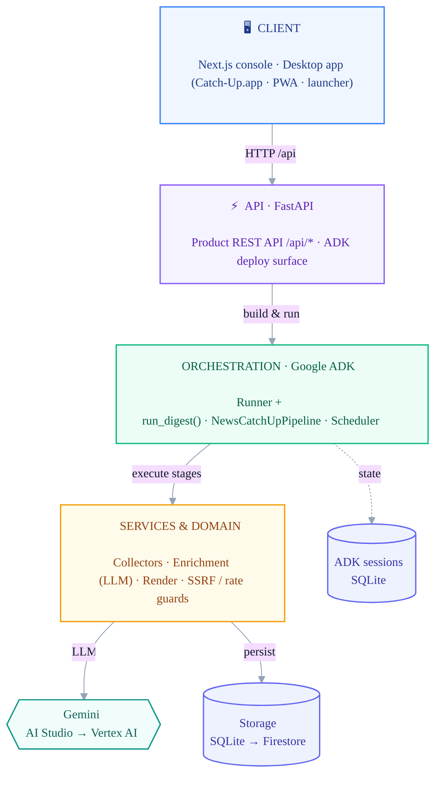
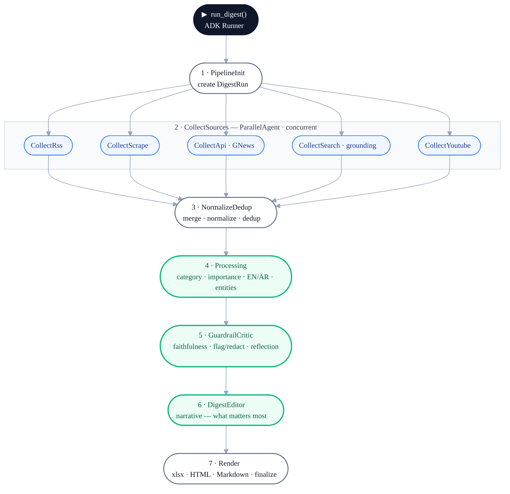

# Catch-Up — Architecture

A multi-agent news catch-up platform on the **Google Agent Development Kit (ADK)**.
It collects news from many sources, uses **Gemini** to categorize / score / summarize
(EN + AR) and fact-check, then renders catch-up digests — served through a **Next.js**
console and a **FastAPI** backend. Built to run **free locally** and scale to **Google
Cloud** by configuration, not a rewrite.

---

## System at a glance

Each layer talks to the next through a narrow interface, so any one can change without
breaking the others — swap **SQLite → Firestore** (the one real storage port), flip
**AI Studio → Vertex AI** (env toggle `GOOGLE_GENAI_USE_VERTEXAI`), or drive runs from
**Cloud Scheduler → `POST /api/runs`** instead of in-process APScheduler.

**Shapes** — ▭ layer · ⬡ external model · ⛁ datastore &nbsp;·&nbsp; **Edges** — solid = data flow · dashed = session state. Each layer talks to the next through a narrow interface.

---

## The agent pipeline

A run is triggered by the **console** (`POST /api/runs`), the **scheduler**, or the
**CLI**. `run_digest()` builds the agent tree and executes it on an **ADK Runner**;
every stage reads and writes shared run state via `EventActions.state_delta`.

🟩 **green = LLM-backed** (Gemini) &nbsp;·&nbsp; ⚪ white = deterministic stage &nbsp;·&nbsp; 🔵 blue = concurrent collector

> **At a glance:** one root `SequentialAgent` runs **7 stages** in order. Stage 2 is a
> `ParallelAgent` that fans out to **up to 5 source collectors** concurrently. **3 stages
> are LLM-backed** (Gemini).

---

## Agents at a glance

| # | Agent | ADK type | What it does |
|---|-------|----------|--------------|
| 1 | **PipelineInit** | `BaseAgent` | Creates the `DigestRun` and seeds run state (`run_id`). |
| 2 | **CollectSources** | `ParallelAgent` | Fans out one collector per enabled source type, run concurrently. |
| ↳ | **SourceCollector ×N** | `BaseAgent` | Collects raw items from **one** source type (RSS · Scrape · GNews · Search · YouTube) into its own state key. |
| 3 | **NormalizeDedup** | `BaseAgent` | Merges all collected items, normalizes them, removes duplicates. |
| 4 | **Processing** 🟩 | `BaseAgent` (LLM) | Gemini enrichment: category, importance score, EN + AR summaries, entities, watchlist boosts. |
| 5 | **GuardrailCritic** 🟩 | `BaseAgent` (LLM) | Faithfulness fact-check of high-importance / watchlisted items; flags + redacts unfaithful summaries; bounded re-summarize (reflection). |
| 6 | **DigestEditor** 🟩 | `BaseAgent` (LLM) | Generates the narrative "what matters most" digest summary. |
| 7 | **Render** | `BaseAgent` | Writes Excel / HTML / Markdown outputs and finalizes the run. |

---

## Components by layer

| Layer | Key components |
|-------|----------------|
| **Client** | Next.js 16 console (React 19, Tailwind v4, shadcn/base-ui, SWR), PWA, `Catch-Up.app` single-port desktop launcher. |
| **API** | FastAPI product API `/api/*` (runs, news, sources, watchlist, settings, health, resolve) + the ADK deploy surface. |
| **Orchestration** | ADK `Runner` + `run_digest()` → `NewsCatchUpPipeline`; single-flight run trigger; APScheduler. |
| **Services & domain** | Collectors (`rss`, `scrape`, `newsapi`, `youtube`, `search`, `feed_discovery`), LLM runtime (`app/llm`), enrichment (`processing`, `critic`, `judge`, `digest_editor`), render (Excel/HTML/Markdown), SSRF-guarded `net`, rate limiter, config store. |
| **Models** | Gemini via `google-genai` (AI Studio → Vertex AI). |
| **Storage** | `StorageBackend` port → SQLite (default) / Firestore adapter; ADK sessions via `DatabaseSessionService` (SQLite). |
| **Cross-cutting** | Settings/config, telemetry/observability, security (API key, localhost write-guard, SSRF guard, rate limit), eval + runtime faithfulness guardrail. |

---

## Quality guardrails

Two LLM-as-judge safeguards protect summary quality, sharing one rubric
(`app/prompts/faithfulness_rubric.md`):

- **Offline eval loop** — scores enrichment against a reference dataset on faithfulness,
  category accuracy, importance calibration, and Arabic translation quality.
- **Runtime critic** (stage 5) — fact-checks high-importance / watchlisted items at digest
  time; unfaithful summaries are **never shown** (flagged + redacted), with bounded
  self-correction.

See **[docs/ADK-GUIDE.md](docs/ADK-GUIDE.md)** for the full ADK architecture & integration guide.
