# Catch-Up — News Intelligence Agent

A **multi-agent global news monitoring & catch-up platform** built on the
Google Agent Development Kit (ADK). It collects news from RSS, web scraping, news APIs,
Google Search grounding, and YouTube; uses Gemini to categorize, importance-score,
summarize (EN/AR), and extract entities; fact-checks the result; and delivers structured
catch-up digests as **Excel, an HTML dashboard, and Markdown** through a **Next.js** web
console.

Built **free to run locally**, with a production-minded architecture that scales to
**Google Cloud** (Cloud Run + Cloud Scheduler + Vertex AI + Firestore) by **configuration —
not a rewrite**.

## Status

**Beta — actively developed.** The local, single-user app runs end-to-end today
(collect → normalize → enrich → fact-check → narrate → render → console). The cloud paths
(Vertex AI, Firestore, Cloud Run, Cloud Scheduler) are wired and unit-tested but **not yet
validated against live GCP**. Design is approved — see
[`ARCHITECTURE.md`](ARCHITECTURE.md) and the
[design spec](docs/superpowers/specs/2026-05-23-adk-catchup-agent-design.md).

## Overview deck

A 13-slide visual tour — the problem, the multi-agent pipeline, the architecture
decisions, and how it was built. **[⬇ Download the PDF](presentation/Catch-Up.pdf)** · [PowerPoint](presentation/Catch-Up.pptx).

[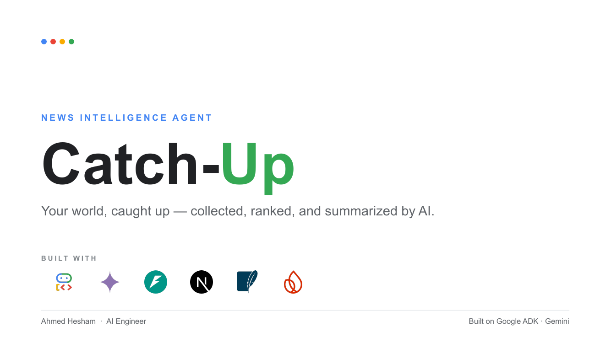](presentation/Catch-Up.pdf)

<details>
<summary><b>▶  Browse all 13 slides</b></summary>

<br/>


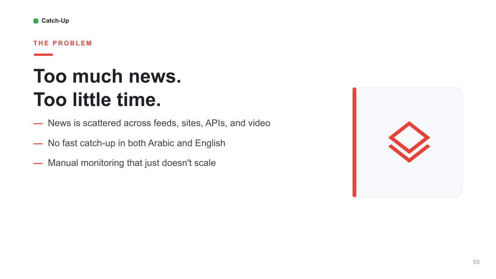
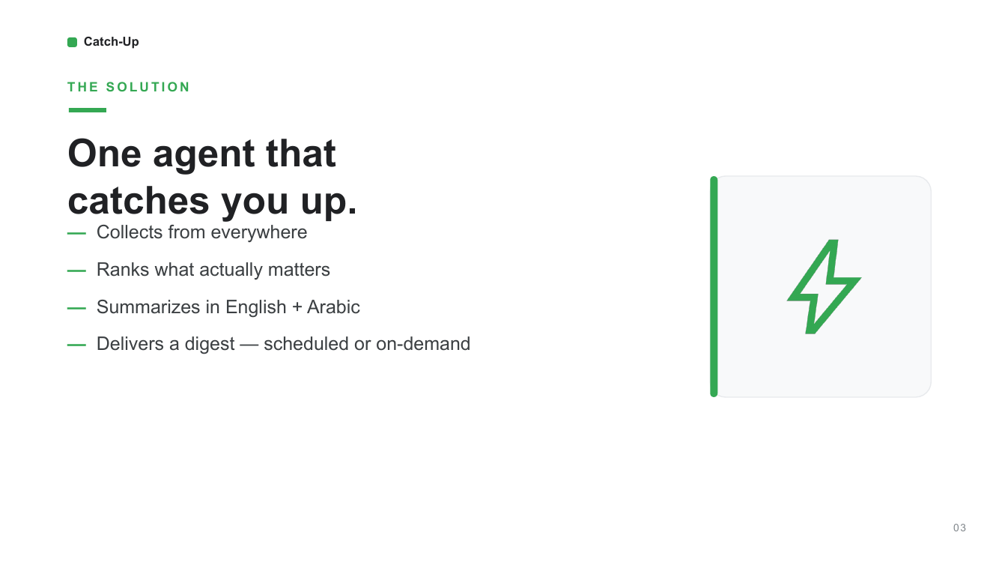
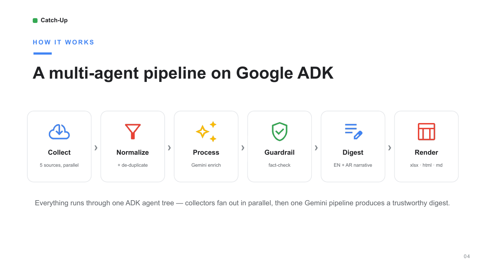
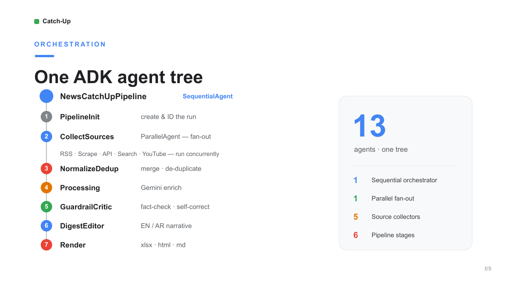
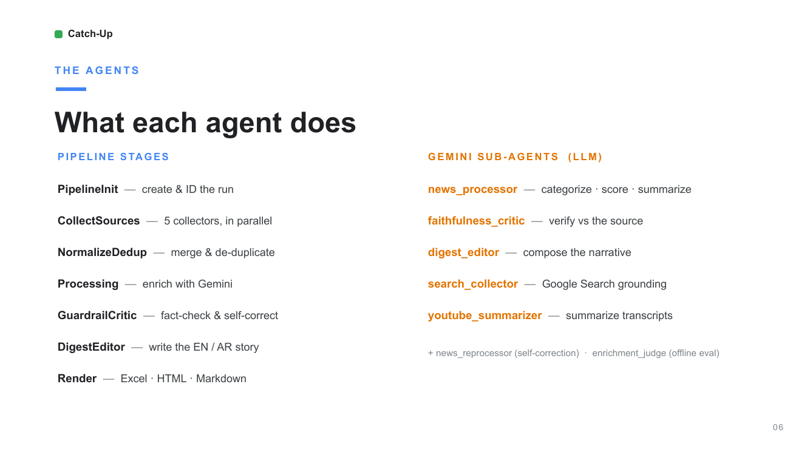
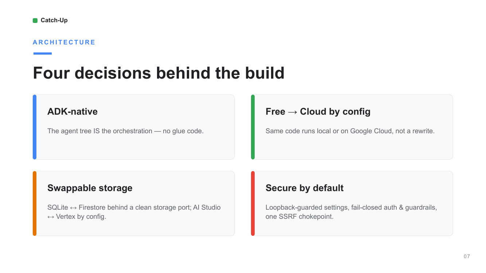
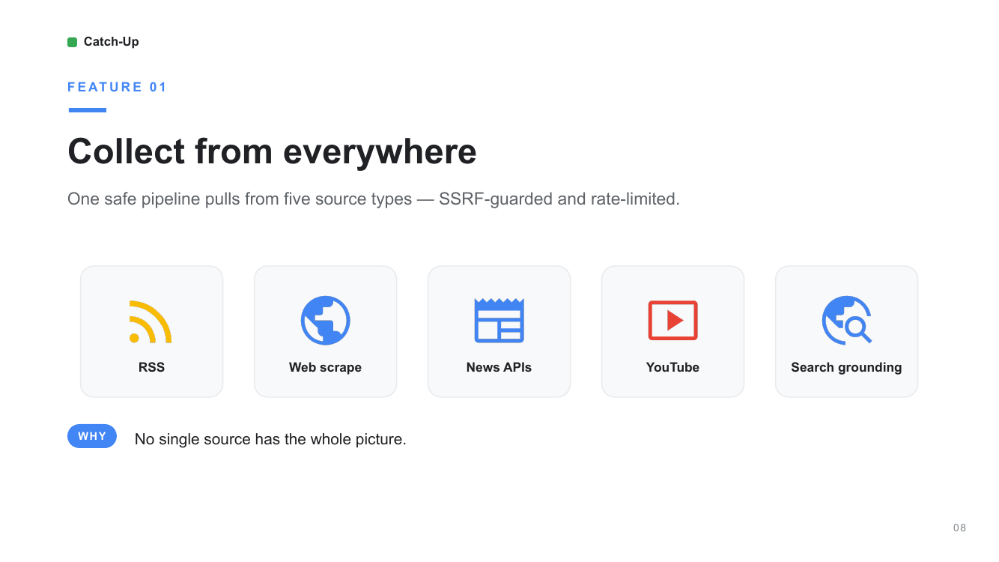
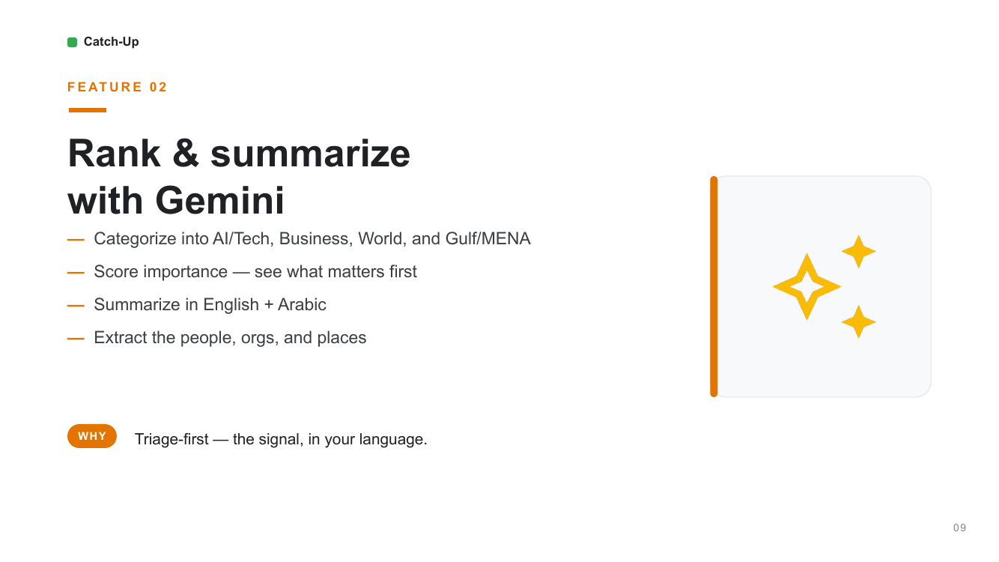
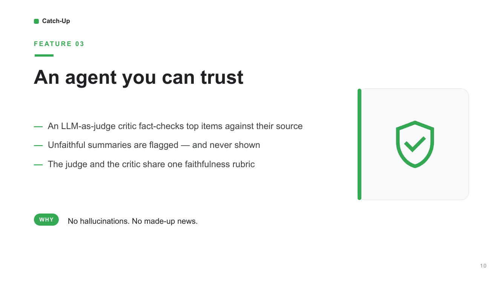
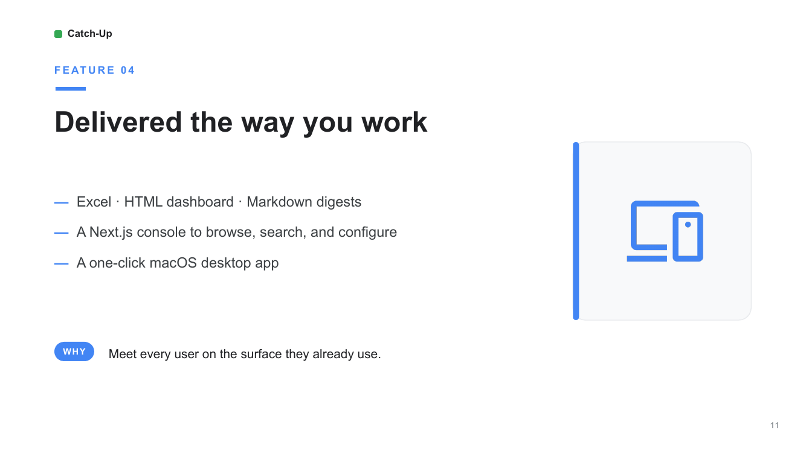
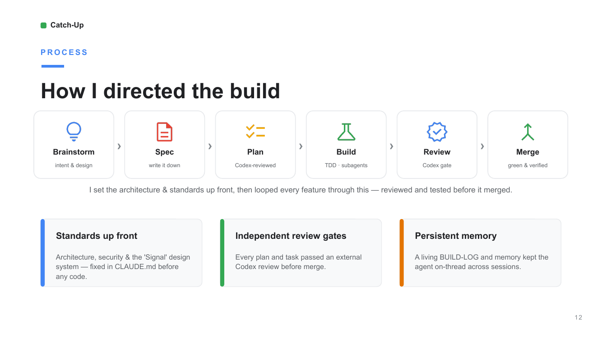
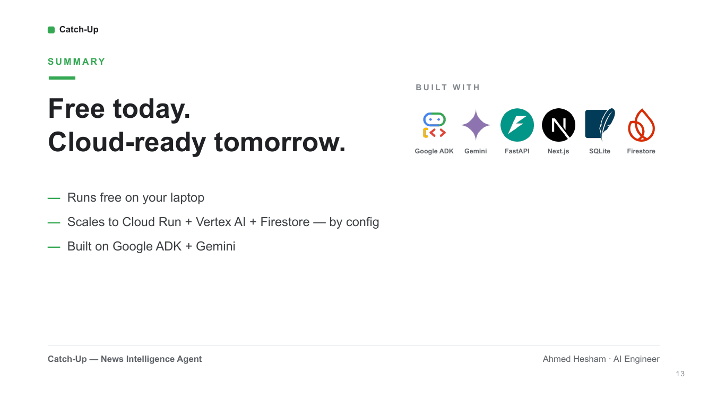

</details>

> Rebuild the deck after editing `presentation/build_deck.py`:
> `uv run --with python-pptx python presentation/build_deck.py` →
> `soffice --headless --convert-to pdf --outdir presentation presentation/Catch-Up.pptx` →
> `pdftoppm -png -r 100 presentation/Catch-Up.pdf presentation/slides/slide`.

## Features

- **Multi-source collection** — RSS, web **scrape** (CSS selector, SSRF-guarded), **GNews**
  API, **Google Search grounding** (via ADK `google_search`), and **YouTube** channel
  monitoring with transcript summaries. Each source is a pluggable collector; add more
  without touching the pipeline.
- **Gemini enrichment** — per-item category classification, importance scoring, **bilingual
  EN + AR summaries**, and entity extraction, with watchlist-driven importance boosts.
- **Faithfulness safety net** — a runtime **critic** fact-checks high-importance / watchlisted
  items against their source and **redacts hallucinated or injection-obeying summaries** (they
  are never shown); an offline **LLM-as-judge** eval loop scores enrichment against a reference
  dataset. Both share one rubric.
- **Narrative digest** — a "what matters most" editor turns the enriched feed into a short
  brief.
- **Three output formats** — `output/digest-<id>.{md,xlsx,html}`: Markdown, an Excel workbook
  (master + per-category sheets), and a themed HTML dashboard.
- **Web console** — a 6-screen Next.js app (Dashboard, News, Digests, Sources, Watchlist,
  Settings) that reads digests and configures the agent over the REST API.
- **Single-port desktop app** — one process serves the built console *and* the API, wrapped in
  a double-clickable macOS `.app` (chromeless window).
- **Scheduling** — in-process cron via APScheduler, or point Cloud Scheduler at the API.
- **Config-driven cloud scaling** — a clean **storage port** swaps **SQLite → Firestore**
  via `STORAGE_BACKEND`; **AI Studio → Vertex AI** is an env toggle (`USE_VERTEXAI`); and the
  same pipeline deploys to **Cloud Run** (a separate product image) — no rewrite. (Storage is
  the one real port; the rest are integrated directly — see [ARCHITECTURE.md](ARCHITECTURE.md).)
- **Runs free locally** — collection/dedup/storage work with no key; the **test suite runs
  fully offline** (no key or quota needed).
- **Security-minded** — localhost-only settings surface, optional shared `API_KEY`, rate
  limiting on the expensive API endpoints, and a single SSRF chokepoint (IP-pinned, size-capped)
  for all outbound fetches.

## Run it as a desktop app (local, single-user)

> ⚠️ **This is a single-user, localhost-only tool.** It binds to `127.0.0.1`, and the
> in-app Settings page lets you set your Gemini key from the UI — which is safe **only**
> because it never leaves your machine. **Do not expose it to the internet** without adding
> real authentication first. Each person who self-hosts uses **their own** Gemini key.

> 🖥️ **The packaged desktop app is macOS-only** (it builds a `.app` bundle and uses
> `osascript`/`open`). On Linux/Windows, use the cross-platform server commands under
> [Running locally](#running-locally) instead.

One process serves the built console **and** the API on a single port, wrapped in a
double-clickable macOS app.

**Prerequisites:** [`uv`](https://docs.astral.sh/uv/), Node 20+ (`npm`), and — only if you
want to regenerate the icon — `librsvg` (`brew install librsvg`).

```bash
git clone <this-repo> && cd ADK-CATCH-UP-Agent
./scripts/make_app.sh            # builds build/Catch-Up.app (with a custom icon)
```

1. Drag **`Catch-Up.app`** to your Desktop (or Applications) and **double-click** it.
   The first launch builds the console (~1–2 min); a notification tells you when it's ready.
2. It opens in a **standalone window** (no browser tabs/address bar). If you only have
   Safari, it opens a normal tab — use **Safari ▸ Add to Dock** for a chromeless window.
3. Go to **Settings**, paste your **free Gemini key** from
   [Google AI Studio](https://aistudio.google.com/apikey), and **Save** (applies on the next run).
4. *(Optional)* In the window, **Install app** (Chrome) or **Add to Dock** (Safari) for a
   permanent Dock icon.

**Prefer no app bundle?** Just run `./scripts/run.sh` (or `uv run python -m app.cli serve`
after building the console with `cd frontend && NEXT_PUBLIC_API_BASE="" npm run build`).

**Ports.** Default `8000`, changeable in **Settings** (saved to `app/.env`, applies on the
next launch). If `8000` is busy, the launcher automatically uses the next free port. Stop the
server with `./scripts/stop.sh`.

## Architecture (at a glance)

```
Next.js console  ⇄  FastAPI API  ⇄  run_digest()/ADK Runner  ⇄  services  ⇄  Storage

NewsCatchUpPipeline (ADK SequentialAgent)
  CollectSources (ParallelAgent: RSS · Scrape · API · Search · YouTube)
  → NormalizeDedup → Processing (LLM) → Guardrail (critic) → DigestEditor (LLM) → Render (xlsx/HTML/MD)
```

**Everything runs through ADK:** `run_digest` builds and executes this agent tree via an ADK `Runner`, and `adk run app` / `adk web` drive the same tree. See **[ARCHITECTURE.md](ARCHITECTURE.md)** for illustrated diagrams and **[docs/ADK-GUIDE.md](docs/ADK-GUIDE.md)** for the full ADK architecture & integration guide.

## Repository layout

```
ADK-CATCH-UP-Agent/
├── app/                       # Python backend — the agent + API
│   ├── agent.py               # ADK root agent (lazy-built)
│   ├── fast_api_app.py        # ADK Agent Engine surface (web UI + /api, behind IAM/IAP)
│   ├── web_app.py             # Cloud Run product app (console + /api; fails closed)
│   ├── cli.py                 # `catchup` CLI — `run` (a digest) and `serve` (the API)
│   ├── core/                  # domain models + config (pydantic-settings)
│   │   └── ports/             # storage interface (the one real hexagonal port)
│   ├── pipeline/              # ADK agents — pipeline, processing, critic, judge, digest_editor, eval
│   ├── services/              # collectors (rss · scrape · newsapi · search · youtube), normalize,
│   │   │                      #   watchlist, scheduler, ratelimit, SSRF-guarded net, config_store
│   │   └── render/            # excel · html · markdown renderers
│   ├── llm/                   # Gemini runtime + structured-output schema/parsing
│   ├── adapters/storage/      # SQLite (default) + Firestore backends
│   ├── api/                   # FastAPI product API (/api/*) + static console mount
│   ├── app_utils/             # telemetry / typing helpers
│   └── prompts/               # prompt templates (faithfulness rubric, summaries, …)
├── frontend/                  # Next.js 16 console (React 19, Tailwind v4, shadcn/base-ui)
│   ├── app/                   # routes: dashboard · news · digests · sources · watchlist · settings
│   ├── components/            # UI by feature (dashboard, digests, sources, watchlist, layout, ui)
│   └── lib/                   # typed API client, zod schemas, shared types
├── config/                    # sources.yaml (news sources) · watchlist.yaml (importance boosts)
├── scripts/                   # make_app.sh · run.sh · stop.sh · eval + render helpers
├── tests/                     # unit · integration · eval  (all run fully offline)
├── docs/                      # ADK-GUIDE, eval guide, design specs, build log
├── ARCHITECTURE.md            # illustrated layer + pipeline diagrams
├── Dockerfile                 # Cloud Run product image (console + API via app.web_app)
├── pyproject.toml             # Python deps + the `catchup` entry point (uv)
└── agents-cli-manifest.yaml   # google-agents-cli scaffold manifest
```

## Tech

ADK · Gemini (AI Studio → Vertex) · FastAPI · SQLite → Firestore · APScheduler → Cloud Scheduler ·
Next.js + shadcn/ui + Tailwind.

## Running locally

```bash
uv sync                                   # install deps
uv run pytest tests -q                    # run the test suite (no API key needed)
uv run --extra lint ruff check app tests  # lint

# Run a digest (collects RSS → enriches with Gemini → writes output/digest-<id>.md)
# Requires a Google AI Studio key for the LLM enrichment + narrative:
export GOOGLE_API_KEY=...   # or put it in .env (gitignored)
uv run python -m app.cli run
```

> `catchup` is the installed console-script alias for `python -m app.cli` (defined in
> `pyproject.toml`), so `uv run catchup run` and `uv run python -m app.cli run` are equivalent.

Sources live in `config/sources.yaml` — each has a `type`: **`rss`**, **`api`** (GNews; set `query`, optional `lang`/`country`), **`scrape`** (set a CSS `selector`), **`search`** (Google Search grounding via ADK `google_search`; set a `query`), or **`youtube`** (monitor a channel; set its `channel_id`, the `UC…` id). Search sources need `GOOGLE_API_KEY` and consume model calls, so they ship **disabled by default**; their results link via Google grounding-redirect URLs and carry no publish date. YouTube sources detect new uploads via the channel's free RSS feed (no key) and summarize each video's transcript (`youtube-transcript-api`; the transcript summary needs `GOOGLE_API_KEY`) — also disabled by default. The GNews collector needs `GNEWS_API_KEY` (`export GNEWS_API_KEY=...` or `.env`). Importance-boost entities/keywords live in `config/watchlist.yaml`. In the **console** you don't need the exact technical value — paste a YouTube **channel URL / @handle** or a newspaper **homepage URL** in the Sources form and click **Resolve** to auto-fill the `channel_id` / discovered RSS feed.
Without keys, collection/dedup/storage still run and the digest degrades gracefully (items unenriched); scrape URLs are SSRF-guarded (public hosts only).

### Configuration reference

All settings are environment variables (or a gitignored `.env` / `app/.env`). The most useful:

| Variable | Default | Purpose |
|---|---|---|
| `GOOGLE_API_KEY` | — | Gemini key (AI Studio) for enrichment, critic, narrative |
| `GNEWS_API_KEY` | — | GNews collector (for `type: api` sources) |
| `APP_PORT` | `8000` | Single-port app/server port (also editable in Settings) |
| `LLM_MODEL` | `gemini-flash-latest` | Gemini model alias |
| `STORAGE_BACKEND` | `sqlite` | `sqlite` or `firestore` |
| `SESSION_BACKEND` | `database` | ADK session store (`database` / `memory`) |
| `USE_VERTEXAI` | `false` | Use Gemini via Vertex AI instead of AI Studio |
| `GOOGLE_CLOUD_PROJECT` / `GOOGLE_CLOUD_LOCATION` | — / `global` | Project for Vertex / Firestore |
| `API_KEY` | — *(open)* | Shared key to protect the product API when exposed beyond loopback |
| `ALLOW_ORIGINS` | `http://localhost:3000` | CORS origins for the API |
| `SCHEDULE_ENABLED` / `SCHEDULE_CRON` / `SCHEDULE_TIMEZONE` | `false` / `""` / `UTC` | In-process scheduler |

See `app/core/config.py` for the complete list (rate-limit, critic, and Firestore tunables).

**Console (frontend) build-time options.** The static console bakes these at
`npm run build` — they are `NEXT_PUBLIC_*`, so they end up **in the browser bundle**.
There is no runtime switch; you choose them per build:

| Variable | Desktop (`run.sh`) | Dev (`npm run dev`) | Cloud Run image |
|---|---|---|---|
| `NEXT_PUBLIC_API_BASE` | `""` (same-origin) | `http://localhost:8000` | `""` (same-origin) |
| `NEXT_PUBLIC_API_KEY` | unset (loopback, no key) | set only if the backend sets `API_KEY` | `--build-arg` = the backend `API_KEY` |

The desktop launcher always builds same-origin with no key (loopback is the perimeter);
for **dev** edit `frontend/.env.local` (copy from `.env.local.example`); for **Cloud Run**
pass the key via `--build-arg NEXT_PUBLIC_API_KEY=...` (see [Deployment ▸ Cloud Run](#2-cloud-run--the-product-console--api)). Because the key is browser-visible, that path must run behind Cloud Run IAM / IAP.

> **Secrets & key rotation.** Keys live only in a gitignored `.env` / `app/.env` — never in
> git (CI runs **gitleaks** on every push to catch accidental leaks). If a key is ever exposed
> or shared, rotate it: regenerate `GOOGLE_API_KEY` in
> [Google AI Studio](https://aistudio.google.com/apikey) and `GNEWS_API_KEY` in your GNews
> dashboard, then update your local `.env`.

## Quality & faithfulness

Two LLM-as-judge safeguards protect summary quality (both build/test offline; live runs need `GOOGLE_API_KEY`):

- **Offline eval loop** — `uv run python scripts/eval_enrichment.py --live` scores enrichment against a reference dataset (`tests/eval/fixtures/`) on four dimensions: **summary faithfulness** (no hallucination/obeyed-injection), category accuracy, importance calibration, and Arabic translation quality, with pass/fail thresholds. See `docs/eval/README.md` for the eval-fix loop.
- **Runtime faithfulness guardrail** — at digest time a critic fact-checks **HIGH-importance and watchlisted** items against their source; unfaithful summaries are **down-ranked + flagged** (never shown), configurable via `critic_*` settings. Both the judge and the critic share one rubric (`app/prompts/faithfulness_rubric.md`).

Each run emits three output files: `output/digest-<id>.md`, `output/digest-<id>.xlsx` (master + per-category sheets), and `output/digest-<id>.html` (Signal-themed dashboard). To generate sample outputs with no API key:

```bash
uv run python scripts/render_smoke.py
```

## API

Start the REST API server (no API key needed for health/dashboard reads):

```bash
uv run python -m app.cli serve          # http://127.0.0.1:8000
uv run python -m app.cli serve --host 0.0.0.0 --port 8080
```

> Exposing beyond loopback (`--host 0.0.0.0`)? **Set `API_KEY` first** — the product API is
> open when it's unset (the server logs a warning to that effect).

| Endpoint | Description |
|---|---|
| `GET /api/health` | Liveness check — returns `{"status":"ok","app":"catch-up","version":"…"}` |
| `GET /api/dashboard` | Latest run, recent runs, category counts, total items |
| `GET /api/news` | News items (filterable by `category` + `importance`) |
| `GET /api/runs` | Recent digest runs |
| `GET /api/runs/{run_id}` | Run detail + its news items |
| `GET /api/sources` | Configured news sources |
| `PUT /api/sources` | Update sources config (YAML round-trip) |
| `POST /api/sources/resolve` | Resolve a pasted link → `channel_id` (youtube) or RSS feed `url` (rss) |
| `GET /api/watchlist` | Watchlist entities + keywords |
| `PUT /api/watchlist` | Update watchlist |
| `POST /api/runs` | Trigger a new digest run (async) |
| `GET /api/settings` | Non-secret local config (`app_host`, `app_port`, `gemini_key_set`, `shadowed_keys`) — loopback only |
| `PUT /api/settings` | Set Gemini key (live) / port (next launch) — loopback + same-origin only |
| `POST /feedback` | Log user feedback — **Agent Engine surface only** (`app/fast_api_app.py`); API-key-gated + rate-limited |
| `GET /docs` | FastAPI auto-generated interactive docs (OpenAPI) |

## Web Console

A **Next.js** console (in `frontend/`) in the "Signal" design language — Inter + IBM Plex Mono, emerald/cyan accents, light + dark with **Auto = system default**, Lucide icons, enterprise sidebar. It reads digests and configures the agent over the REST API above.

```bash
# 1. Start the API (separate terminal, from the repo root)
uv run python -m app.cli serve            # http://127.0.0.1:8000

# 2. Start the console
cd frontend
npm install
cp .env.local.example .env.local          # NEXT_PUBLIC_API_BASE=http://localhost:8000
npm run dev                                # http://localhost:3000
```

Screens:

| Screen | What it does |
|---|---|
| **Dashboard** | Stats, "what matters most" narrative, by-category breakdown, latest-run health |
| **Digests** | Browse past runs; open a run to see grouped, summarized items + output files |
| **News** | Filterable feed of collected items (category · importance · limit) |
| **Sources** | Add/edit/delete sources (RSS · scrape · API · search · YouTube), category hints, live enable toggle |
| **Watchlist** | Manage entities & keywords that boost importance (+0.25) |
| **Settings** | Set your Gemini API key (applied live) and the app port (next launch) — loopback-only |

"Run now" triggers a digest via `POST /api/runs`; full enrichment (summaries, scores) needs a Google AI Studio key on the API host. The frontend test suite runs fully offline (`cd frontend && npm test`) — `fetch` is mocked, no backend or quota needed.

## Scheduling (opt-in)

Set `SCHEDULE_ENABLED=true` + `SCHEDULE_CRON="0 7 * * *"` (+ optional `SCHEDULE_TIMEZONE`). `catchup serve` then runs the digest in-process on that cron via APScheduler, sharing the single-flight guard with manual `POST /api/runs`. In production, point Cloud Scheduler at `POST /api/runs` instead (see `docs/ADK-GUIDE.md` §6).

## Deployment

Three honest paths — pick one; each does exactly what it says.

### 1. Local desktop (works today)

`Catch-Up.app` / `./scripts/run.sh` → `create_app()` single-port on `127.0.0.1`,
SQLite, no API key needed (loopback only). See
[Run it as a desktop app](#run-it-as-a-desktop-app-local-single-user).

### 2. Cloud Run — the product (console + API)

The `Dockerfile` builds the Next.js console **and** serves it plus `/api/*` on one
port via `app.web_app` (the product surface — **no** ADK-native routes). Required:
set **`API_KEY`** (the image fails closed without it) and `ALLOW_ORIGINS`. Optional:
`STORAGE_BACKEND=firestore` (the image installs the `[firestore]` extra — deploy
`firestore.indexes.json` first via `gcloud firestore indexes composite create` /
`firebase deploy --only firestore:indexes`) and `USE_VERTEXAI=true` for Vertex.
Scheduled runs: point **Cloud Scheduler at `POST /api/runs`** (sending the API key).

The console is a static export, so it authenticates with the **same** key **baked
at build time** (`--build-arg NEXT_PUBLIC_API_KEY`). That key is visible in the
browser bundle, so the product image **must run behind Cloud Run IAM / IAP** — that
authenticated perimeter is the real user auth; the app `API_KEY` is a secondary
guard (and what Cloud Scheduler sends). Build with the key, then deploy requiring
authentication:

```bash
KEY=$(openssl rand -hex 24)
docker build --build-arg NEXT_PUBLIC_API_KEY="$KEY" -t gcr.io/$PROJECT/catch-up .
docker push gcr.io/$PROJECT/catch-up
gcloud run deploy catch-up --image gcr.io/$PROJECT/catch-up \
  --no-allow-unauthenticated \
  --set-env-vars API_KEY="$KEY",ALLOW_ORIGINS=https://your-console
```

### 3. ADK Agent Engine (`agents-cli deploy`)

`app/fast_api_app.py` exposes the ADK web UI + ADK-native routes (`/run`, sessions,
evals) for Agent Engine / Gemini Enterprise. Those ADK-native routes are **not**
app-key-gated, so this surface **must run behind Cloud Run IAM / IAP**. It serves
no Next.js console — use path 2 for the product UI.

> **Firestore status:** the adapter passes the full storage contract against the
> Firestore **emulator**, but has **not** been validated against live GCP Firestore.
> Deploy the composite indexes (`firestore.indexes.json`) before relying on filtered
> news queries. **Migration runbook** — `backfill_is_flagged()` is a one-time,
> manually-run op (it is not wired into startup and is idempotent). Run it once on any
> pre-`is_flagged` data, e.g.:
> ```python
> from app.core.config import Settings
> from app.runner import build_storage
> n = build_storage(Settings(storage_backend="firestore")).backfill_is_flagged()
> print(f"backfilled {n} docs")
> ```

## How it was built (kept for learning)

This repo is intentionally transparent about its development. Alongside the code you'll find:

- **[`ARCHITECTURE.md`](ARCHITECTURE.md)** — illustrated layer + pipeline diagrams.
- **[`docs/ADK-GUIDE.md`](docs/ADK-GUIDE.md)** — how the system uses Google ADK end-to-end.
- **[`docs/superpowers/specs/`](docs/superpowers/specs/)** — the approved design specs.
- **[`docs/superpowers/plans/`](docs/superpowers/plans/)** + **[`docs/BUILD-LOG.md`](docs/BUILD-LOG.md)** — the full implementation plans and a step-by-step build journal.
- **`CLAUDE.md`**, **`frontend/AGENTS.md`**, **`.claude/codex-reviews/`** — the AI-assistant instructions and code-review ledgers used while building it.

These design specs, implementation plans, and AI-agent instructions are kept **deliberately, as a learning resource** and an honest record of how the project was built with AI-assisted (agentic) development. They are **not required** to run or use Catch-Up — feel free to ignore or delete them in your fork.

## Contributing

The backend uses `uv`; the frontend uses `npm`. Before opening a PR:

```bash
uv run pytest tests -q                          # backend tests (offline)
uv run --extra lint ruff check app tests scripts # backend lint
cd frontend && npm test && npm run lint          # frontend tests (offline) + lint
```

Please keep the model alias (`gemini-flash-latest`) unchanged unless that's the point of the PR, and keep the test suite offline (inject external calls).

## License

**Apache-2.0** — see [`LICENSE`](LICENSE) and [`NOTICE`](NOTICE). Portions derive from the
[`google-agents-cli`](https://pypi.org/project/google-agents-cli/) scaffold (© Google LLC,
Apache-2.0), whose notices are retained in the relevant source files.
